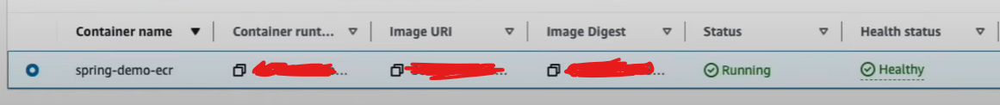

# Project Title
AWS-SpringBoot-Deploy

## Overview
deploying an automated pipeline on AWS CodeDeploy to facilitate ci/cd 

## How To Replicate Project 
- step1: create a GitHub repository for your project
- step2: create a springboot maven folder at start.spring.io and push it to your GitHub repository
- step3: launch intelliJ IDE open folder and create a simple RestAPI in main file
- step4: create a docker file through CommandLine with command docker build -t aws-springboot-deploy
- step5: create a YAML file and configure it 
- step6: open AWS ECR and create a repository named spring-demo-ecr, make sure to input ECR login and URI command that's in AWS to your yml file 
- step7: git add. , git commit -m, and finally git push project to your GitHub make sure to check your project on port:8080 
- step8: generate a personal access token from GitHub, then create a CodeBuild and add token to CodeBuild
- step9: go to IAM roles and give access/permission to CodeBuild-springboot-aws-deploy-service-role
- step10: first create ECS cluster called spring-cluster, second create a task definition call spring-demo-task-def. make sure both of these are launch type fargate
- step11: go to EC2>Security Groups> edit inbound rules. allow access to port 8080
- step12: create CodePipeline name it AWS-demo-pipeline

## Highlights
**Technologies Used**: 
- Java, Spring Boot, Maven, Simple RestApi, AWS, EC2, ECR, Fargate, CodeDeploy, CodeBuild, Docker
- YAML File, Spring Web, Spring Boot Actuator

**Key Functionality**: 
- deployment of automated pipeline to AWS CodePipeline

**Challenges Overcome**: 
- configuration issues allowing access/permission to AWS CodeBuild 
- configuration issues trying to allow/give access to CodeDeploy to deploy

## Screenshots

